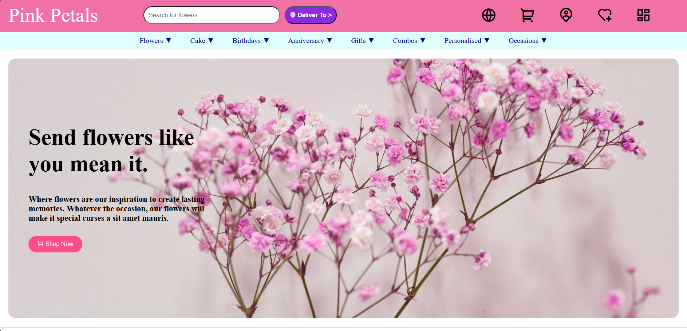

Pink Petal – Flower Website
Pink Petal is a simple flower website landing page created using HTML and CSS.
The project focuses on building a clean UI layout for an online flower and gift store with multiple sections such as products, categories, cakes, flowers, and customer reviews.
This project is mainly built to practice frontend layout design and styling using pure HTML and CSS.

-Features
Flower and gift themed landing page
Navigation menu with categories
Hero banner section
Product showcase section
Gift categories section
Cakes and flowers collection
Customer reviews section
Informational content about gifting services
Footer with useful links

🛠️ Technologies Used
HTML5 – Website structure
CSS3 – Styling and layout
Remix Icons CDN – Icons used in header

## 📷 Preview

